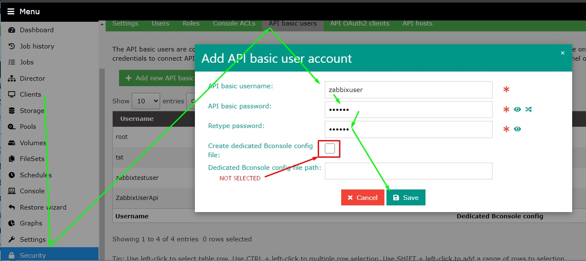

# bacula_zabbix_via_http
Monitoring Bacula from Zabbix ( baculum via http)
Template for Bacula / Baculum  Web API monitoring

## RU
Используется api из этой документации:
https://bacula.org/downloads/baculum/baculum-api
используется стандартный порт 9096

Заведите пользователя в "Базовые пользователи API"
http://192.168.1.18:9096/web/security/

Не использовать галочку "Создать выделенный файл конфигурации Bconsol:"

Используйте в макросах username и password созданные ранее.
'{$USERNAME}' '{$PASS}'

          
## ENG
The api from this documentation is used:
https://bacula.org/downloads/baculum/baculum-api
standard port 9096 is used

Start a user in “API Basic Users”
http://192.168.1.18:9096/web/security/

Do not use the checkbox “Create a dedicated Bconsol configuration file:”

Use in macros username and password created earlier.
'{$USERNAME}' '{$PASS}'

